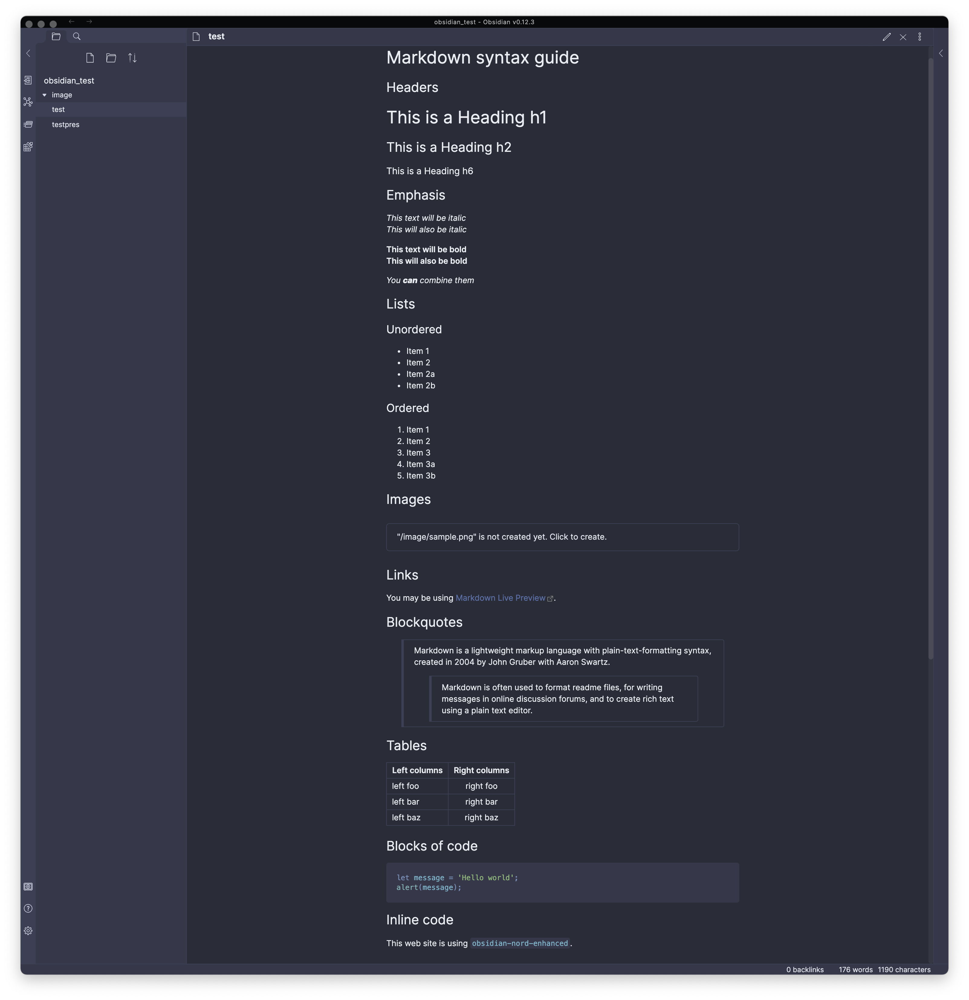

# Obsidian Nord Enhanced

This is a [Nord Theme](https://www.nordtheme.com/) implementation for [Obsidian.md](https://obsidian.md).

To install it, find it in the theme explorer through Obsidian. If you want to add to the theme, simply copy the [obsidian.css](obsidian.css) file to your vault in the `./obsidian/themes` folder, after making changes to view live differences.

It differs from [this implementation](https://github.com/insanum/obsidian_nord) in a number of ways.

1. It does not color headings. I found this to be messy.
1. It follows the official [Nord Theme Documentation](https://www.nordtheme.com/docs/colors-and-palettes) for coloring elements.
1. It adds syntax highlighting in the proper colors for code blocks.
1. It adds nord styling when using the presentation plugin.
1. The structure of the [obsidian.css](obsidian.css) file is altered to be more easily updated and extended in the future.

## Examples

